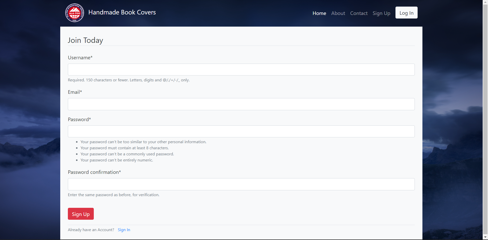
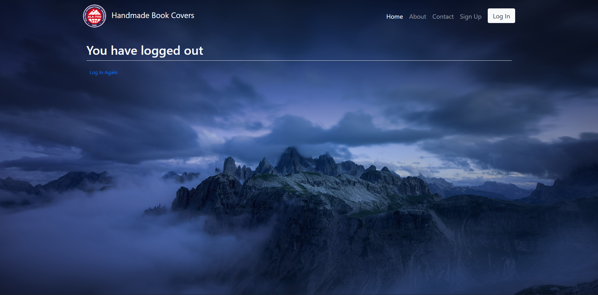

# Chatroom Django Web App
Deployed at https://bookcoverswebsite.herokuapp.com/

## Requirements Checklist

✅ Deploy online
- link to a web app

✅ Github
- readme description of project
- link to deploy
- database schema <a href="#erd">(ERD image)</a>
- <a href="#screenshots">screenshots</a>

✅ PostgreSQL Database

✅ Frontend
- logo of AIU (Ala-Too International University)
- about and copyright section added
- authorization page
- registration page
- order/main page

#

## About The Project
A simple chatroom, where you can register as a user, log into account, send messages and log back out whenever you want.

### Home Page

### Log In Page

### Sign Up Page

### Log Out Page

### About Page

### Contacts Page

(<a href="#top">back to top</a>)

#

## ERD

The User table is maintained by Django itself and is not connected to the Item table.

#

## Built With
* [Django](https://www.djangoproject.com/)
* [PostgreSQL](https://www.postgresql.org/)
* [Bootstrap4](https://getbootstrap.com/)

(<a href="#top">back to top</a>)

